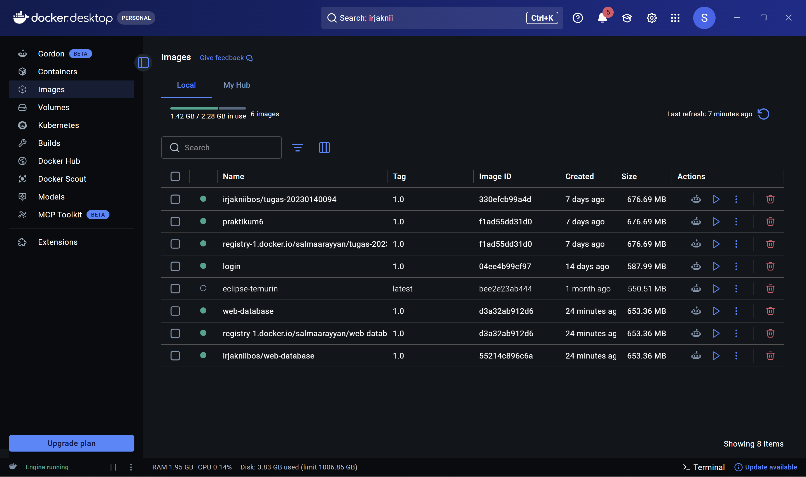
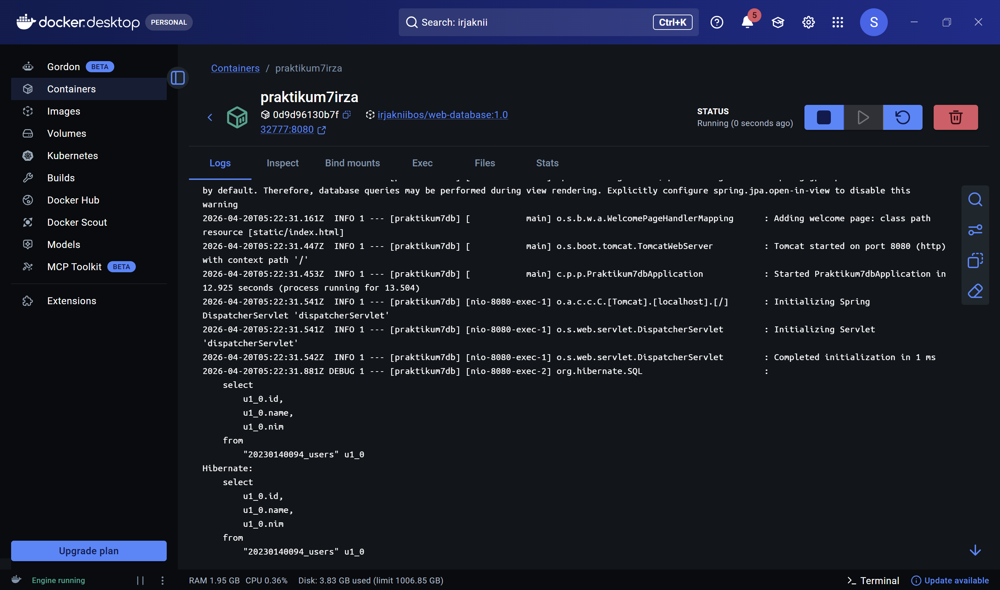
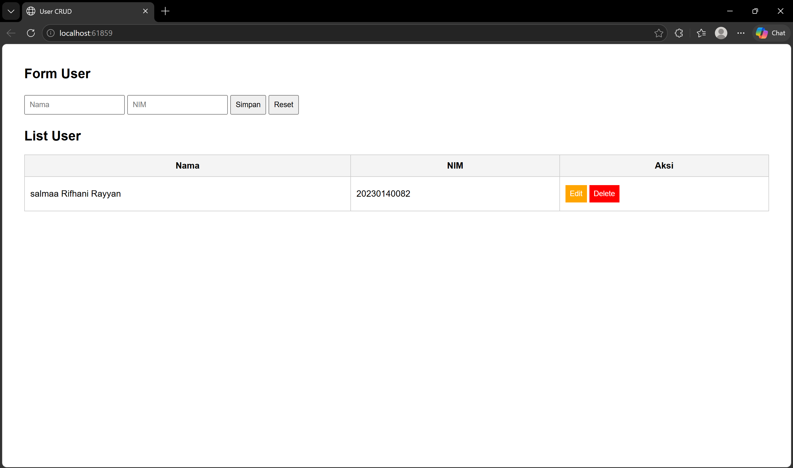
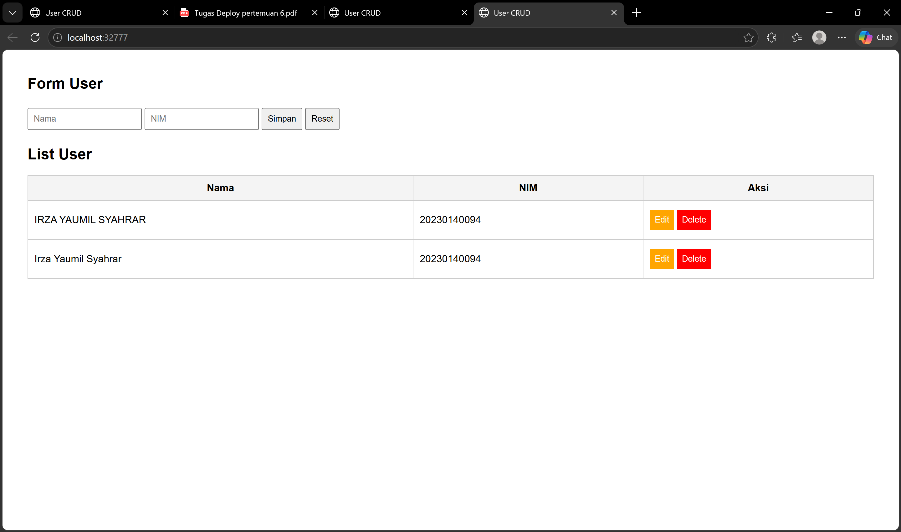

## 1. Daftar Image di Docker Desktop

**Screenshot Daftar Image:**

---

## 2. Status Container di Docker Desktop

**Screenshot Daftar Container:**

---

## 3. Tampilan Aplikasi Web (Milik Sendiri)

**Screenshot Halaman Form (Milik Sendiri):**

---

## 4. Tampilan Aplikasi Web (Hasil Pull Teman)

**Screenshot Halaman Form (Milik Teman):**
